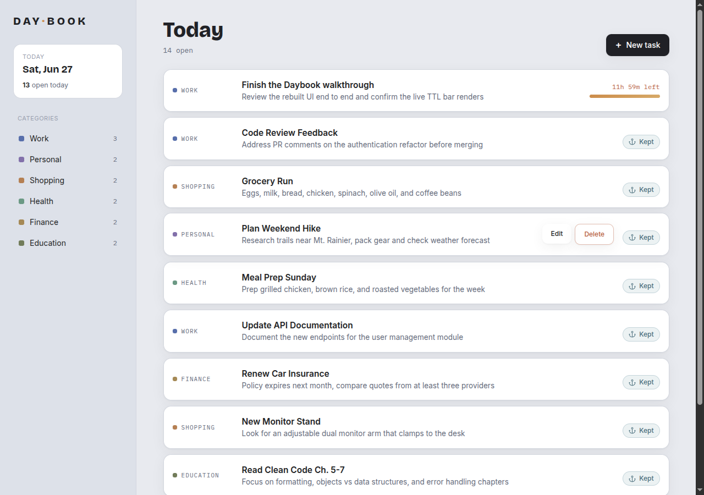

# Daybook

A small, opinionated to-do list built around one idea: **a day's tasks are ephemeral**. Ad-hoc tasks you add live for **12 hours** and then quietly expire; the ones that matter are explicitly **kept** and persist. The UI makes time a first-class dimension — every ephemeral task shows a depleting time bar, while kept tasks wear a cool "⚓ Kept" chip (warm = fleeting, cool = anchored).

It's a full-stack reference app: a conventional RESTful Laravel API and a custom-designed React front end, both fully tested, running on a **zero-extra-service** stack (SQLite — no MySQL, no Redis).



## Tech stack

| Layer | Choice |
|---|---|
| Backend | Laravel 12, PHP 8.4 |
| Database | **SQLite** (single file; cache & queue on `database`, sessions on `file`) |
| Frontend | React 18, React Router 7, **Tailwind CSS 3**, Vite 6 |
| API client | axios wrapper over `/api/v1` |
| Backend tests | PHPUnit 11 (in-memory SQLite) |
| Frontend tests | Vitest + React Testing Library (jsdom) |
| Tooling | Laravel Sail (Docker), Laravel Pint |

There are **no MySQL or Redis services** — the app runs against a single SQLite file, so a dev or prod environment needs only the app container.

## Features

- **RESTful CRUD API** for tasks and categories under `/api/v1`, with API Resources, pagination, proper status codes (200/201/204/422/404), and a consistent JSON error envelope.
- **12-hour TTL** on tasks created through the API (`expires_at`). Seeded data is permanent. A global Eloquent scope hides expired tasks immediately; a `tasks:prune` command (scheduled hourly) force-deletes them.
- **Soft deletes** with a History / recycle-bin view (`?trashed=only`).
- **Categories** as a full CRUD resource, each exposing an active `tasks_count`.
- **Rate limiting** at the Laravel layer: 60 req/min general, 15 req/min for writes.
- **Daybook design system** — a hand-built Tailwind component library (no UI framework), with a signature per-task time bar. Accessibility: Lighthouse a11y / best-practices / SEO all 100.
- **Tests as a gate**: 23 backend feature/unit tests, 26 frontend component/integration tests.

## Quick start (Laravel Sail)

Prerequisites: Docker (or Podman) and Docker Compose. Everything else runs inside the Sail container.

```bash
# 1. Get the Sail binary (one-off; uses your host Composer, or a Composer container)
composer install

# 2. Environment
cp .env.example .env

# 3. Start the single app container
./vendor/bin/sail up -d

# 4. Inside the container: app key, dependencies, database, assets
./vendor/bin/sail artisan key:generate
./vendor/bin/sail composer install
./vendor/bin/sail npm install
./vendor/bin/sail artisan migrate:fresh --seed
./vendor/bin/sail npm run build      # or: ./vendor/bin/sail npm run dev
```

Open the app at **http://localhost** (or `http://localhost:${APP_PORT}` if you set `APP_PORT` in `.env`).

> **Rootless Podman / SELinux (Fedora, etc.):** the bind-mounted project is owned by your host user, which maps to container UID 0 under rootless Podman, so the default `sail` user cannot write to it. Run the app as root inside the container (the officially documented Sail fix) by adding a local, git-ignored `docker-compose.override.yml`:
> ```yaml
> services:
>   laravel.test:
>     environment:
>       SUPERVISOR_PHP_USER: 'root'
> ```
> and `APP_USER=root` in your `.env` (so `sail` CLI commands also run as root). The committed `docker-compose.yml` already adds `:z` to the bind mount for SELinux relabeling.

## The API

All routes are under `/api/v1` and return JSON. List endpoints return `{ data, links, meta }` (paginated, 10 per page); single-resource endpoints return `{ data }`.

### Tasks

| Method | Path | Description | Success |
|---|---|---|---|
| GET | `/api/v1/tasks` | List active tasks. Query: `?category_id=`, `?trashed=only` (history), `?page=` | 200 |
| POST | `/api/v1/tasks` | Create a task (server sets `expires_at = now + 12h`) | 201 |
| GET | `/api/v1/tasks/{task}` | Show a task (expired/soft-deleted → 404 via the global scope) | 200 |
| PUT | `/api/v1/tasks/{task}` | Full update | 200 |
| DELETE | `/api/v1/tasks/{task}` | Soft delete | 204 |

### Categories

| Method | Path | Description | Success |
|---|---|---|---|
| GET | `/api/v1/categories` | List categories (each includes active `tasks_count`) | 200 |
| POST | `/api/v1/categories` | Create a category | 201 |
| GET | `/api/v1/categories/{category}` | Show a category | 200 |
| PUT | `/api/v1/categories/{category}` | Update | 200 |
| DELETE | `/api/v1/categories/{category}` | Soft delete | 204 |

Validation failures return `422` with `{ message, errors }`; missing resources return `404` with `{ message }`; unexpected errors return a generic `500` message (no stack traces). Write routes carry the stricter `throttle:api-write` limit.

### The 12-hour TTL

- A `tasks.expires_at` timestamp (nullable) drives the behaviour. **API-created tasks** get `now()->addHours(12)`; **seeded/factory rows** leave it `null` (permanent — "kept").
- `App\Models\Scopes\NotExpiredScope` is a global scope on `Task` that excludes rows whose `expires_at` is in the past, so expired tasks disappear from every query (and route-model binding 404s them) **even before pruning runs** — correctness never depends on the scheduler.
- `php artisan tasks:prune` force-deletes expired rows and is registered `hourly()` in `app/Console/Kernel.php`. Run the scheduler with `./vendor/bin/sail artisan schedule:work` if you want pruning locally; it's housekeeping only.

## Project structure

```
app/
  Console/Commands/PruneExpiredTasks.php      # tasks:prune (hourly)
  Exceptions/Handler.php                      # JSON error envelope for /api/*
  Http/
    Controllers/Api/V1/                       # TaskController, CategoryController (resourceful)
    Requests/                                 # Store/Update Task & Category form requests
    Resources/                                # TaskResource, CategoryResource
  Models/
    Task.php  Category.php                    # singular Eloquent models, SoftDeletes
    Scopes/NotExpiredScope.php                # the TTL global scope
  Providers/RouteServiceProvider.php          # api / api-write rate limiters
database/
  migrations/                                 # categories, tasks (+expires_at), cache, jobs
  factories/  seeders/                        # TaskFactory/CategoryFactory; permanent seed data
routes/
  api.php                                     # /api/v1 task + category routes
  web.php                                     # SPA catch-all -> welcome view
resources/
  js/
    lib/{api.js,time.js}                      # API client + TTL math (describeExpiry)
    components/ui/                            # Button, Card, inputs, Badge, Spinner, EmptyState,
                                              #   TimeBar, KeptChip, CategoryTag (design system)
    components/layout/{AppShell,Rail}.jsx     # the daybook shell + left rail
    features/tasks/                           # TaskList, TaskRow, TaskForm, TaskDetail
    features/categories/                      # CategoryList, CategoryForm, CategoryDetail
    features/history/HistoryView.jsx          # soft-deleted tasks (read-only)
    AppData.jsx  Index.jsx                    # categories context + router (createRoot)
  css/app.css                                 # Tailwind layers + TTL-bar utilities/keyframes
tailwind.config.js  postcss.config.cjs        # Daybook design tokens
vitest.config.js                              # jsdom test env (separate from vite.config.js)
tests/
  Feature/Api/V1/{TaskApiTest,CategoryApiTest}.php
  Unit/{NotExpiredScopeTest,PruneExpiredTasksTest}.php
docs/
  superpowers/specs|plans/                    # design + implementation docs
  design/daybook-mockup.html                  # the design reference + walkthrough screenshots
```

## Front-end views

- **Today** (`/`) — the day's tasks; each shows a depleting time bar (ephemeral) or a Kept chip (permanent). Category filter and "load more" pagination.
- **New / Edit task** (`/tasks/create`, `/tasks/:id/edit`) — title, category, details, with inline `422` field errors.
- **Task detail** (`/tasks/:id`).
- **Categories** (`/categories`, plus create / detail / edit).
- **History** (`/history`) — soft-deleted tasks, faded and read-only.

## Running the tests

```bash
# Backend (PHPUnit, in-memory SQLite)
./vendor/bin/sail test

# Frontend (Vitest + React Testing Library)
./vendor/bin/sail npm run test:run

# Lint/format
./vendor/bin/sail php vendor/bin/pint
```

## Production notes

`Dockerfile` and `docker-compose.prod.yml` build a single app container (nginx + php-fpm via supervisor) using `pdo_sqlite`. The SQLite file is persisted in the `sqlite-data` named volume mounted at `/var/www/html/database`. Because that volume shadows the file baked into the image, **run `php artisan migrate --force` (and optionally `--seed`) on the first deploy** to initialize the database in the volume. Rate limiting is also enforced at the nginx layer; the app additionally throttles at the Laravel layer.
